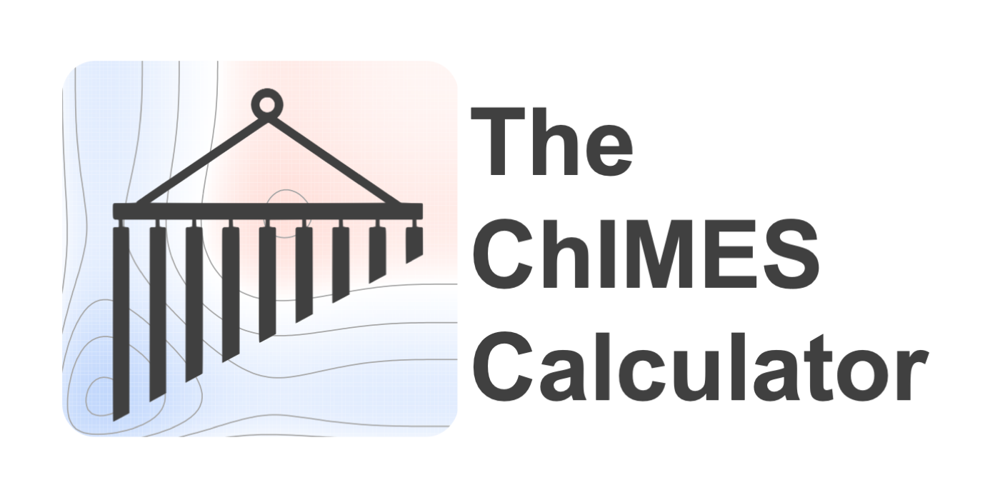

    

The Chebyshev Interaction Model for Efficient Simulation (ChIMES) is a machine-learned interatomic potential that can target chemical reactivity. ChIMES models are able to approach quantum-accuracy through a systematically improvable explicitly many-bodied basis comprised of linear combinations of Chebyshev polynomials. ChIMES has successfully been applied to a number of condensed phase systems, including water under ambient and extreme conditions, molten carbon, and liquid carbon monoxide under planetary interior conditions. ChIMES can also be used as a many-body repulsive energy for the density functional based tight binding (DFTB) method.

The ChIMES calculator comprises a flexible tool set for evaluating ChIMES interactions (e.g. in simulations, single point calculations, etc). Users have the option of directly embedding the ChIMES calculator within their codes (e.g. see ‘’The ChIMES Calculator,’’ in the documentation for advanced users), or evaluating interactions through the beginner-friendly serial interface, each of which have Python, C++, C, and FORTRAN API’s.

Documentation
----------------

[**Full documentation**](https://chimes-calculator.readthedocs.io/en/latest/) is available.

Community
------------------------

Questions, discussion, and contributions (e.g. bug fixes, documentation, and extensions) are welcome. 

Additional Resources: [ChIMES Google group](https://groups.google.com/g/chimes_software).

Contributing
------------------------

Contributions to the ChIMES calculator should be made through a pull request, with ``develop`` as the destination branch. A test suite log file should be attached to the PR. For additional contributing guidelines, see the [documentation](https://chimes-calculator.readthedocs.io/en/latest/contributing.html).

The ChIMES calculator `develop` branch has the latest contributions. Pull requests should target `develop`, and users who want the latest package versions,
features, etc. can use `develop`.

Releases
--------

For most users, we recommend using the ChIMES calculator [stable releases](https://github.com/rk-lindsey/chimes_calculator/releases).

ChIMES releases are indicated via semantic versioning tags of the form vA.B.C. The letters A, B, and C indicate major changes impacting the API (i.e., precluding backwards compatibility), minor backwards compatible changes, and backwards compatible bug fixes, respectively

Authors
----------------

The ChIMES calculator was developed by Rebecca K. Lindsey, Nir Goldman, and Laurence E Fried.

Contributors can be found [here](https://github.com/rk-lindsey/chimes_calculator/graphs/contributors).

Citing
----------------

See [the documentation](https://chimes-calculator.readthedocs.io/en/latest/citing.html) for guidance on referencing ChIMES and the ChIMES calculator in a publication.

License
----------------

The ChIMES calculator is distributed under terms of [LGPL v3.0 License](https://github.com/rk-lindsey/chimes_calculator/blob/main/LICENSE).

LLNL-CODE-817533
