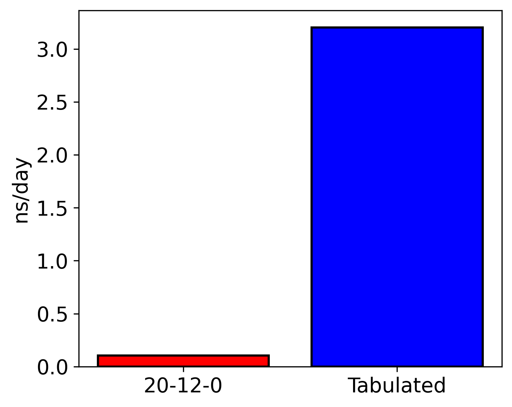

.. _utils:

ChIMES Calculator Utilities
========================================

The PES Generator
*****************

Input
^^^^^^^^^

A utility for generating ChIMES potential energy surface scans for *n*-body clusters is available in ``utils/pes_generator``. To use this utility, create a file name ``config.py`` in the desired working directory, structured as follows:

.. code-block:: python

    CHMS_REPO  = "/path/to/your/chimes_calculator/repository/"
    
    PARAM_FILE = "/path/to/your/chimes_calculator/repository/serial_interface/tests/force_fields/test_params.CHON.txt"
    
    PAIRTYPES  = [0,    3,    5   ] # Pair type index for scans, i.e. number after "PAIRTYPE PARAMS:" in parameter file
    PAIRSTART  = [1.0,  1.0,  1.0 ] # Smallest distance for scan
    PAIRSTOP   = [4.0,  4.0,  4.0 ] # Largest distance for scan
    PAIRSTEP   = [0.01, 0.01, 0.01] # Step size for scan
    
    TRIPTYPES  = [1,    4   ] # Triplet type index for scans, i.e. number after "TRIPLETTYPE PARAMS:" in parameter file
    TRIPSTART  = [1.0,  1.0 ] # Smallest distance for scan
    TRIPSTOP   = [4.0,  4.0 ] # Largest distance for scan
    TRIPSTEP   = [0.10, 0.10] # Step size for scan
    
    
Variables ``CHMS_REPO`` and ``PARAM_FILE`` specify the ``chimes_calculator`` repository location, and path to the ChIMES parameter of file. Note that paths should be provided in their absolute form. Following these variables, three sets of options are provided. Focusing on options beginning with ``PAIR``, one must provide the following: 

* A list of pair type indices for which scans should be generated

    * Indices should correspond to values following ``PAIRTYPE PARAMS:`` in the target parameter file
    
* A list of the minimum pair distance for each pair type to consider during the scan
* A list of the maximum pair distance for each pair type to consider during the scan
* A scan step size

Note that the bounds of pair-distances must be within the defined range of potential i.e the inner and outer cutoffs specified in the params.txt file. The stepsize for 3-body scans should not be too small as that would lead to long computation times. A reasonable step size should be chosen to ensure the PES scan is completed in practical time.

All input and output distances are in Angstroms, and all energies are provided in kcal/mol. Additionally, note that the penalty function will be included in scan results unless ``PAIRSTART`` is greater than the sum of the pair interaction inner cutoff and the penalty kick-in distance, or if the user has set ``PAIR CHEBYSHEV PENALTY SCALING:`` to zero in the parameter file. Similar variables must be set to specify desired 3-body scans. Note that empty lists can be provided if no scan is desired.

Output
^^^^^^^^^

All *n*-body scans will produce output scan files named like ``chimes_scan_<n>b.type_<index>.dat``, where <n> is the bodiedness, and <index> is the ``PAIRTYPES``or ``TRIPTYPES`` index. Many-body scans will produce additional files named like ``chimes_scan_2+3b.type_<index>.dat`` , which include contributions from lower-bodied interactions as well. 

The first line in each output file provides a comment (prepended by a ``#``) starting and stopping distances followed by the scan step size. Following, each line provides the *ij* (and if appropriate, *ik*, *il*, *jk*, *jl*, and *kl* distances, respectively) and the corresponding cluster energy. For example, consider the ``test_params.CHON.txt`` parameter file provided in ``serial_interface/tests/force_fields/``, which contains the following 3-body interaction:

.. code-block:: text

    TRIPLETTYPE PARAMS:
       INDEX: 5 ATOMS: C H O
       PAIRS: CH CO HO UNIQUE: 54 TOTAL: 54
         index  |  powers  |  equiv index  |  param index  |       parameter       
       ----------------------------------------------------------------------------
          0       0  1  1         0               0        6.500656496400314
          1       0  1  2         1               1        3.7493801790331345
          2       0  1  3         2               2        0.0
          3       0  2  1         3               3        -4.7147262741975711
          4       0  2  2         4               4        -2.0557295465375991
          5       0  2  3         5               5        -1.1723283559758126

In the above example, ``TRIPTYPES`` is 5, corresponding to i, j, and k atoms of type C, H, and O, respectively. Thus, lines in the corresponding resulting 3-body scan file would give the *ij* (C-H), *ik* (C-O), and *jk* (H-O) distances, followed by the corresponding cluster energy.

Visualizing
^^^^^^^^^^^

Two-body scans can be immediately be plotted by most software (e.g. matplotlib, xmgrace, etc.), however additional considerations are needed to plot the > 3 dimensional 3- and/or 4-body scans. Three body scans can visualized in slices. An additional utility is provided in  utils/pes_generator (i.e. ``gnuplotify``), which can be used to extract these slices in a gnuplot splot-friendly format. To use this script, the user must specify a 3-body scan file and a *ij* distance at which to make the slice. Note that the *ij* distance must be one listed in the 3-body scan file. For the ``test_params.CHON.txt`` and ``config.py`` example above, this can be achieved with:

.. code-block:: bash

    python3.X gnuplotlify.py chimes_scan_2+3b.type_0.dat 2.5
    
This command will produce a file named like ``chimes_scan_2+3b.type_0.dat.gnuplot.2.5`` that can be plotted in gnuplot via:

.. code-block:: bash

     splot 'chimes_scan_2+3b.type_0.dat.gnuplot.2.5' u 1:2:3 w pm3d

Tabulation
*****************

ChIMES interactions can be precomputed and stored in look-up tables compatible with the ChIMES_Calculator as implemented in LAMMPS. These tables can substantially speed up your ChIMES calculations by replacing on-the-fly Chebyshev expansions. Due to memory requirements, tabulation is recommended for 2- and 3-body interactions, only. A speed comparison between a normal 20-12-0 ChIMES model and the same model running with tabulation is provided in Figure 1 below.

   Speed comparison between a 20-12-0 model to the same model running tabulated, both models have a cutoff of 6 Angstroms for both 2 and 3 body interactions. This test was performed on 216 atoms of cubic diamond crystaline silicon at 800 K and 2.33 gcc. The simulation was performed using 1, 9480 Xeon Max cpu.

To use this capability, one must generate the tabulation files and update the parameter file to point to these tabulation files. Instructions for doing so are given below:

Input
^^^^^^^^^

A utility for tabulating a ChIMES potential energy surface 2- and 3-body interactions is available in ``utils/tabulator``. To use this utility, use the same ``config.py`` file described for the PES generator.

Note: The PES generator uses the chimes_calculator. This means that (1) if penalty parameters are *not* explicitlly defined in the parameter file, the calculator will introduce default values during the tabulation; (2) if penalty parameters are explicitly defined and *both* the prefactor :math:`A_{p}` or kick-in distance :math:`d_{p}` are non-zero, the user-defined penalty will be introduced during the tabulation; (3) if penalty parameters are explicitly defined and either the prefactor :math:`A_{p}` or kick-in distance:math:`d_{p}` are zero, no contribution from the penalty function will enter into the tabulation. 

Output
^^^^^^^^^

All *n*-body scans will produce output scan files named like ``chimes_scan_<n>b.type_<index>.dat.energy`` or ``chimes_scan_<n>b.type_<index>.dat.force``, where <n> is the bodiedness, and <index> is the ``PAIRTYPES`` or ``TRIPTYPES`` index. All units match units used in the PES Generator.

The first line in each output file provides a comment listing the number of tabulated points, this should be roughly :math:`\frac{\text{max} - \text{min}}{\text{stepsize}_{2B}}` for 2b and :math:`\left( \frac{\text{max} - \text{min}}{\text{stepsize}_{3B}} \right)^3` for 3b. Following, each line provides the *ij* (and if appropriate, *ik* and *jk* distances, respectively) and the corresponding cluster energy or force. 

Running simulations
^^^^^^^^^^^^^^^^^^^^

In order to use tabulated models in ChIMES-LAMMPS simulations, the parameter file (e.g., params.txt) must be updated to reference them. To do so:

Modify sections that look like:

.. code-block:: text

    PAIR CHEBYSHEV PARAMS 

    PAIRTYPE PARAMS: 0 H H

To read, e.g.:

.. code-block:: text

    PAIR CHEBYSHEV PARAMS 

    PAIRTYPE PARAMS: 0 H H TABULATED ./chimes_scan_2b.type_0.dat

This will need to be done for each pair type.

For 3b interactions text such as: 

.. code-block:: text

    TRIPLETTYPE PARAMS:
        INDEX: 0 ATOMS: H H H

modify such that they read: 

.. code-block:: text

    TRIPLETTYPE PARAMS:
        INDEX: 0 ATOMS: H H H TABULATED ./chimes_scan_3b.type_0.dat

Due to memory requirements, tabulation is only supported in ChIMES-LAMMPS for 2- and 3-body interactions.

ChIMES Fingerprint Generator
****************************

Input
^^^^^^^^^

The **ChIMES Fingerprint Generator** is a utility for generating on-the-fly *n*-body cluster distribution fingerprints during LAMMPS simulations. These fingerprints provide a compact, quantitative representation of material configurations that can be used for ML-IAM development.

This tool is particularly useful for:

- **Monitoring equilibration and dynamics** – Track changes in structure over time to assess whether a system has reached equilibrium or is sampling new configurations.
- **Automated active learning workflows** – Integrate fingerprints into your ML-IAM loop to flag underrepresented environments or inform uncertainty quantification.
- **Dataset curation and refinement** – Use fingerprints to automatically cluster, select, or discard configurations based on structural similarity.

Ultimately, ChIMES fingerprints support automated decision-making in model training and simulation analysis, improving the robustness and reliability of ML-IAMs.

An example ChIMES fingerprint is shown below:

.. figure:: fingerprint_example.pdf
   :align: center
   :width: 80%

   Sample configuration of liquid carbon at a density of 0.5 g/cm³ and temperature of 1000 K shown in panel (a), alongside the corresponding cluster-graph fingerprints for (b) 2-body, (c) 3-body, and (d) 4-body interactions obtained using a Morse transformation approach.

To enable fingerprint generation, install LAMMPS with the ``FINGERPRINT`` build option:

.. code-block:: bash

    sh install.sh FINGERPRINT

After installation, modify your LAMMPS pair_style chimesFF specification to contain the  ``fingerprint`` keyword and an integer specifying the frequency with which fingerprints are recorded n.

.. code-block:: text

    ##############################################
    ###   Model definition  ###
    ##############################################

    pair_style	chimesFF fingerprint 1

Once your simulation is complete, use the provided post-processing script to organize and clean the generated cluster lists:

.. code-block:: bash

    sh "/path/to/your/chimes_calculator/repository/chimesFF/src/FP/post_process.sh"

With the cleaned cluster lists, you can now generate the cluster-graph fingerprints using the following command:

.. code-block:: bash

    sh "/path/to/your/chimes_calculator/repository/chimesFF/src/FP/histogram [CHIMES PARAMETER FILE]"

This step requires the ``[CHIMES PARAMETER FILE]`` file used to run the ChIMES-LAMMPS simulation to provide the necessary element indexing for fingerprint computation.

Output
^^^^^^^^^

All *n*-body fingerprints will produce output files named like ``<frame_n>-<frame_n>.<n>b_clu-s.hist``, where <n> is the bodiedness.

The first column is the cluster-graph dissimilarity whereas the second column is the dissimilarity frequency.

For citing
^^^^^^^^^^

If you use this software in your work, please cite:

Laubach, Benjamin, and Rebecca Lindsey. Cluster-Graph Fingerprinting: A Framework for Quantitative Analysis of Machine-Learned Interatomic Model Training and Simulation Data (2025). `ChemRxiv <https://chemrxiv.org/engage/chemrxiv/article-details/67f0635bfa469535b9cbed7b>`_

